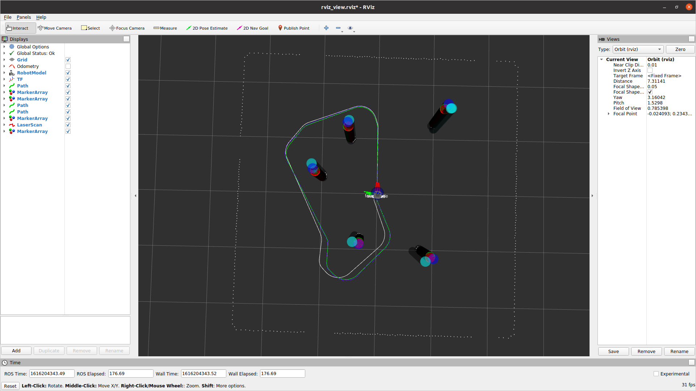
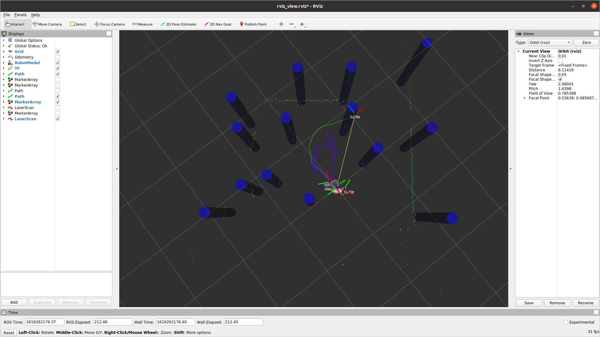
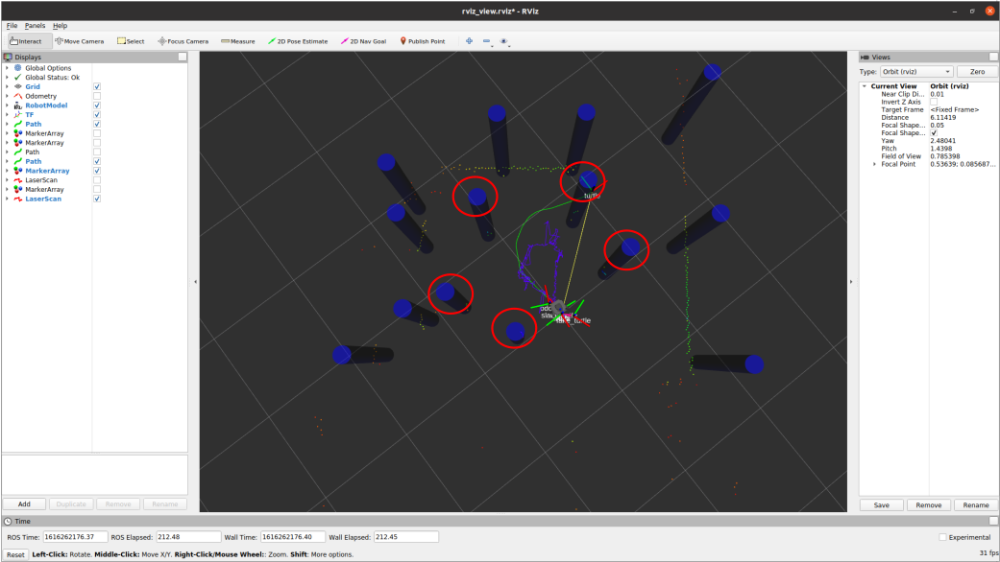

# nuslam
* A package that find turtle and landmark locations in map based on commanded twist and sensor information using Feature-Based Kalman Filter SLAM. 

# Example Usage
1. ```
    roslaunch nuslam slam.launch use_odom:=false robot:=localhost
    ```
    This command call a simulated world and a turtle with Gaussian noise from `tube_world.launch`. Running the 
    file will calcualtes a slam_turtle with filtered noise. If robot runs into an obstacle, slam algorithm will update map
    to accommodate the change. The robot is controlled by `turtlebot3_teleop_key`. The robot model is
    displayed based on calculated pose.  
    Path for fake_odom turtle is shown in white line. Path for the true turtle path is shown in green line. Path found from Kalman Filter is shown in blue line. 
    Obstacles at known locations are shown as green tubes. Obstacles with added Gaussian noise are shown as red tubes. Obstacles found from Kalman Filter are shown as blue tubes.   
2. ```
    roslaunch nuslam landmark_detect.launch
    ```
    Launches a simulated world with landmarks and laser scan messages. Landmarks calcualted from laser scan are shown as light blue tubes with respect to odometry.    
3. ``` 
    roslaunch nuslam unknown_data_assoc.launch simulate:=true
    ``` 
    Launches landmark detections and slam algorithm in a simulated world.   
4. ```
    roslaunch nuslam unknown_data_assoc.launch robot:=<turtlebot_name>.local
    ```
    Launches landmark detections and slam algorithm in the real world.


# Configuration
`state_var` - variance of Gaussian noise for Kalman states   
`sensor_var` - variance of Gaussian noise for sensors   

# Testing  
Screenshots of rviz after robot driving in the simulated world is shown below. The state noise is N(0, 0.01). The sensor noise is N(0, 0.01). Observation distance of robot is 3.0.   
  
  

Screenshot of rviz after robot driving in the simulated world with unknown data association is shown below. The noise level in laser scan is 0.005. The pose error between the actual robot and odometry is (0.0045, 0.044). The pose error between the actual robot and the slam estimate is (0.00090, 0.0012).
  

Robot is driving in the real world with 5 unkwnon tubes as landmarks. The gif below is playing at 4x speed.
  


Screenshot of rviz after robot driving in the real world with unknown data association is shown below. The final pose of slam is (0.041, 0.0050, 3.05). The pose error between the actual robot and odometry is (0.0045, 0.044). The pose error between the actual robot and the slam estimate is (0.00090, 0.0012). 
  
Landmarks labeled below represent the tubes in real world.
  


