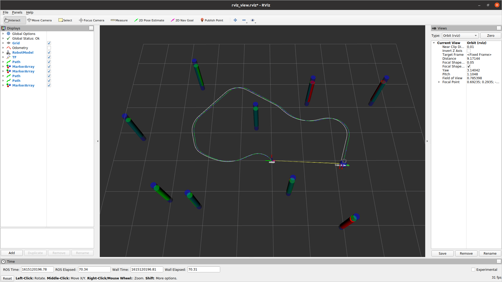
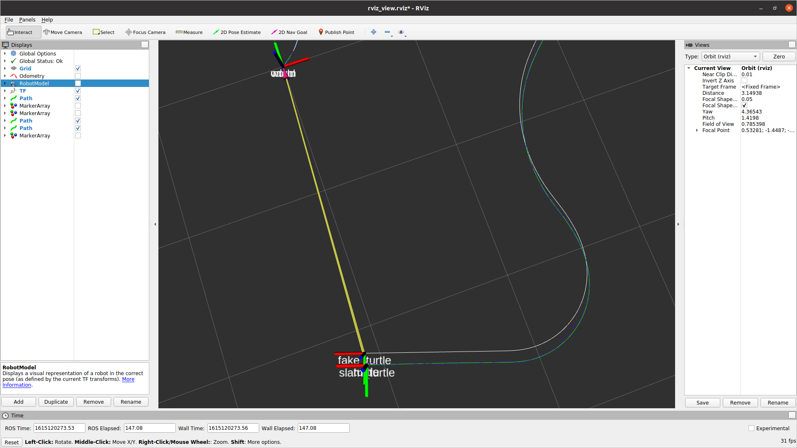

# nuslam
* A package that find turtle and landmark locations in map based on commanded twist and sensor information using Feature-Based Kalman Filter SLAM. 

# Example Usage
```
roslaunch nuslam slam.launch use_odom:=false robot:=localhost
```
This command call a simulated world and a turtle with Gaussian noise from `tube_world.launch`. Running the 
file will calcualtes a slam_turtle with filtered noise. If robot runs into an obstacle, slam algorithm will update map
to accommodate the change. The robot is controlled by `turtlebot3_teleop_key`. The robot model is
displayed based on calculated pose.  
Path for fake_odom turtle is shown in white line. Path for the true turtle path is shown in green line. Path found from Kalman Filter is shown in blue line. 
Obstacles at known locations are shown as green tubes. Obstacles with added Gaussian noise are shown as red tubes. Obstacles found from Kalman Filter are shown as blue tubes.   


# Testing  
Screenshots of rviz after robot driving in the simulated world is shown below. The twist noise is N(0, 0.01). The slip noise ratio is -0.01 to 0.01. The obstacle noise if N(0, 0.001). Observation distance of robot is 3.0.   
  
  


