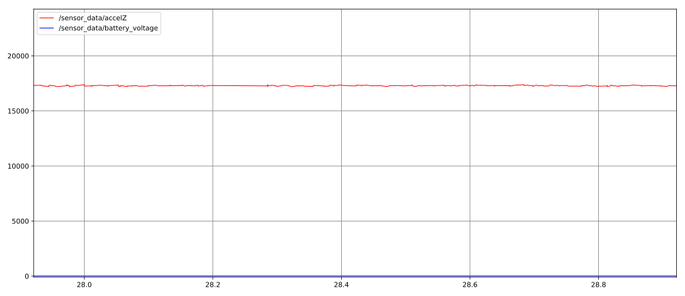

# nuturtle_robot
* A package that runs nodes on the real turtlebot

# Example Usage
1. On turtlebot, build the worksapce and run
    ```
    roslaunch nuturtle_robot basic_remote.launch robot:=localhost
    ```
    Launchfile `basic_remote.launch` will allow running nodes on the turtlebot locally. Argument `robot` should be the hostname of the turtlebot.

    On computer, run the following instead
    ```
    roslaunch nuturtle_robot basic_remote.launch robot:=<turtlebot_name>.local
    ```
    Images below shows an output of `rqt_graph` and `rqt_plot` of `sensor_data` when the launch file is running.
    
    

2. To control turtlebot and view odometry information in rviz run
    ```
    roslaunch nuturtle_robot odom_teleop.launch
    ```
    Set argument `circle` to true if want to make turtle drive in cricles. Set argument `circle` to false if want to drive turtle using `teleop_keyboard`. This argument is default to true.


# Testing with Odometry
The following setups are tested using a real burger turtlebot.
1. After driving the turtlebot forward and backward without rotation several times, then stopping at initial position, the final location of turtlebot is (0, 0, 0).


2. After rotating the turtlebot clockwise and counterclockwise without translation several times, then stopping at initial position, the final location of turtlebot is (0, 0, 0).


2. After moving the turtlebot clockwise and counterclockwise in circles, then stopping at initial position, the final location of turtlebot is (0, 0, 0).


3. After deliberately drive the turtlebot forward and backward using maximum velocity (around 0.22), then stopping at initial position, the final location of turtlebot is (0, 0, 0). This is close to (0, 0, 0), but as seen in the physical demo, turtlebot has shiffted from its actual initial position.


